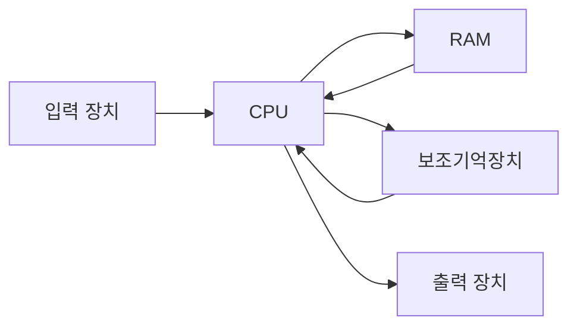

# 컴퓨터 구조의 큰 그림

## 개요

컴퓨터 구조는 크게 두 가지 관점으로 볼 수 있다.

1. 컴퓨터가 이해하는 정보
2. 컴퓨터의 네 가지 핵심 부품

우리는 명령어와 데이터를 사용해 컴퓨터와 상호작용한다.
컴퓨터는 이 정보를 처리하기 위해 여러 하드웨어 부품을 협력시킨다.

## 컴퓨터가 이해하는 정보

컴퓨터가 이해하는 정보는 크게 명령어와 데이터다.

- 명령어: 컴퓨터에게 어떤 일을 할지 지시하는 정보
- 데이터: 명령어가 처리할 대상이 되는 정보

우리는 데이터를 입력하고, 명령어를 통해 원하는 결과를 얻는다.

## 네 가지 핵심 부품

컴퓨터의 핵심 부품은 다음과 같다.

- CPU
- 주기억장치(RAM)
- 보조기억장치
- 입출력 장치

### CPU

CPU는 중앙처리장치로, 컴퓨터의 핵심 처리 장치다.
명령어를 해석하고 실행하는 역할을 한다.

CPU 내부에는 크게 세 가지 구성 요소가 있다.

- ALU: 계산을 담당한다.
- 레지스터: CPU 내부의 매우 작은 임시 저장 공간이다.
- 제어장치: 명령어를 해석하고 다른 장치에 제어 신호를 보낸다.

CPU는 RAM에서 명령어와 데이터를 가져와 처리한다.

### RAM

RAM은 주기억장치다.
실행 중인 프로그램과 관련된 명령어, 데이터, 중간 결과를 저장한다.

RAM은 휘발성 메모리이므로 전원이 꺼지면 저장된 내용이 사라진다.
백엔드나 운영체제 문맥에서 말하는 런타임 메모리는 보통 이 RAM을 가리킨다.

### 보조기억장치

보조기억장치는 데이터를 장기 보관하기 위한 장치다.
전원이 꺼져도 내용이 유지되는 비휘발성 저장 장치다.

대표적으로 HDD와 SSD가 있다.

### 입출력 장치

입출력 장치는 사람과 컴퓨터가 정보를 주고받는 장치다.

- 입력 장치: 키보드, 마우스, 마이크
- 출력 장치: 모니터, 스피커

사용자는 입력 장치를 통해 명령어와 데이터를 전달하고, 출력 장치를 통해 처리 결과를 확인한다.

## 메인보드와 버스

메인보드는 각 부품을 물리적으로 연결하고 서로 통신할 수 있게 해주는 기반이다.

각 장치는 버스를 통해 데이터를 주고받는다.
버스는 장치들 사이의 통로라고 이해하면 된다.

시스템 버스는 보통 다음 세 가지로 나눈다.

- 주소 버스
- 데이터 버스
- 제어 버스

주소 버스는 어디에 접근할지 알려주고, 데이터 버스는 실제 데이터를 주고받으며, 제어 버스는 읽기/쓰기 같은 제어 신호를 전달한다.

## 전체 흐름

컴퓨터를 사용할 때의 흐름은 대략 다음과 같다.

입력 장치를 통해 정보가 들어오고, CPU가 RAM에서 필요한 명령어와 데이터를 가져와 처리한다.
처리 결과는 출력 장치로 나오거나 보조기억장치에 저장된다.

## 핵심 정리

- 컴퓨터가 이해하는 정보는 명령어와 데이터다.
- 컴퓨터의 핵심 부품은 CPU, RAM, 보조기억장치, 입출력 장치다.
- CPU는 명령어를 해석하고 실행한다.
- RAM은 실행 중인 정보를 저장하는 주기억장치다.
- 보조기억장치는 장기 저장을 담당한다.
- 메인보드는 부품을 연결하는 기반이고, 버스는 장치들 사이의 통로다.
- 시스템 버스는 주소 버스, 데이터 버스, 제어 버스로 나뉜다.
