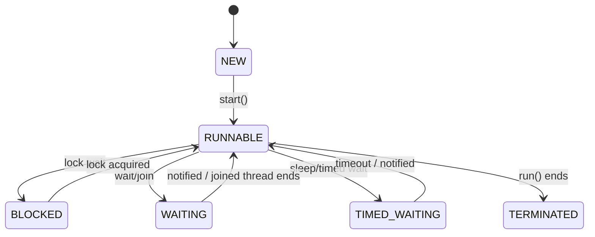

# Java Thread 정보와 생명주기

## 개요

`Thread`는 Java에서 실행 흐름을 표현하는 객체다.
스레드는 생성된 뒤 여러 상태를 거치며, 실행이 끝나면 `TERMINATED` 상태가 된다.

이 문서는 스레드의 기본 정보, 상태, 그리고 `start()`와 `run()`의 관계를 정리한다.

## 스레드 정보

### 스레드 ID

- JVM 안에서 각 스레드를 구분하기 위한 고유한 값이다.
- 스레드가 생성될 때 할당된다.
- 직접 지정할 수 없다.

### 스레드 이름

- 스레드의 이름이다.
- 중복이 가능하다.
- 디버깅이나 로그 확인에 유용하다.

### 스레드 우선순위

- 범위는 `1`부터 `10`까지다.
- 기본값은 `5`다.
- 값이 높을수록 더 자주 실행될 가능성이 커진다.
- 다만 실제 스케줄링 결과는 JVM과 운영체제 구현에 따라 달라질 수 있다.

### 스레드 그룹

- 스레드가 속한 그룹을 나타낸다.
- 기본적으로 새 스레드는 부모 스레드와 같은 그룹에 속한다.
- 그룹 단위로 관리하거나 일괄 종료 같은 작업에 활용할 수 있다.
- 실제로는 자주 쓰지 않는 편이다.

### 데몬 여부

- 데몬 스레드인지 여부를 나타낸다.
- 사용자 스레드가 모두 종료되면 JVM은 종료되므로, 데몬 스레드는 JVM 종료를 막지 않는다.

## 스레드 상태

Java의 스레드 상태는 `Thread.State`로 표현한다.

- `NEW`: 아직 시작되지 않은 상태
- `RUNNABLE`: 실행 중이거나 실행될 준비가 된 상태
- `BLOCKED`: 모니터 락을 얻지 못해 대기하는 상태
- `WAITING`: 다른 스레드의 특정 작업이 끝나기를 기다리는 상태
- `TIMED_WAITING`: 일정 시간 동안 기다리는 상태
- `TERMINATED`: 실행을 마친 상태

`BLOCKED`, `WAITING`, `TIMED_WAITING`은 모두 일시 중지 상태로 볼 수 있다.

## 생명주기

스레드는 생성된 뒤 시작되고, 실행 중에는 여러 상태를 오간다.
모든 실행 흐름이 끝나면 `TERMINATED` 상태가 된다.

## start()와 run()

`start()`를 호출하면 새 스레드가 시작된다.
이때 해당 스레드가 사용할 스택이 준비되고, 그 위에서 `run()`이 실행된다.

`run()`은 일반 메서드다.
`run()`을 직접 호출하면 새 스레드가 생기지 않고, 현재 스레드에서 그냥 메서드 호출처럼 실행된다.

즉, 새 스레드를 만들려면 `start()`를 호출해야 한다.

## 스택과 스택 프레임

스레드가 시작되면 그 스레드 전용 스택이 준비된다.
`run()`이 실행되면 `run()`에 대한 스택 프레임이 쌓인다.

이후 `run()` 내부에서 다른 메서드가 호출될 때마다 추가 스택 프레임이 쌓인다.
메서드 실행이 끝나면 해당 프레임이 제거된다.

모든 프레임이 제거되고 더 이상 실행할 코드가 없으면 스레드는 종료되고 `TERMINATED` 상태가 된다.

## 상태별 해석

### NEW

- 객체는 만들어졌지만 아직 `start()`되지 않았다.

### RUNNABLE

- 실행 중이거나 실행 가능한 상태다.
- Java는 운영체제의 세부 실행 중 여부를 구분하지 않고 이 둘을 함께 표현한다.

### BLOCKED

- `synchronized` 같은 모니터 락을 얻지 못해 대기한다.

### WAITING

- 다른 스레드가 특정 동작을 끝내기를 기다린다.
- 대표적으로 `wait()`, `join()`이 있다.

### TIMED_WAITING

- 일정 시간 동안 기다린다.
- 대표적으로 `sleep()`이 있다.

### TERMINATED

- `run()`이 끝나서 스레드가 종료된 상태다.
- 재실행할 수 없다.
- 다시 실행하려면 새 스레드를 만들어야 한다.

## 핵심 정리

- `Thread`는 실행 흐름을 표현하는 객체다.
- 스레드 ID는 JVM 내부에서 유일하며 직접 지정할 수 없다.
- 이름, 우선순위, 그룹, 데몬 여부는 스레드의 기본 정보다.
- `start()`가 새 스레드를 시작하고, `run()`은 그 스레드에서 실행되는 일반 메서드다.
- 스택 프레임은 메서드 호출 단위로 쌓이고 제거된다.
- 모든 실행이 끝나면 스레드는 `TERMINATED` 상태가 된다.
- `BLOCKED`, `WAITING`, `TIMED_WAITING`은 모두 일시 중지 상태다.
